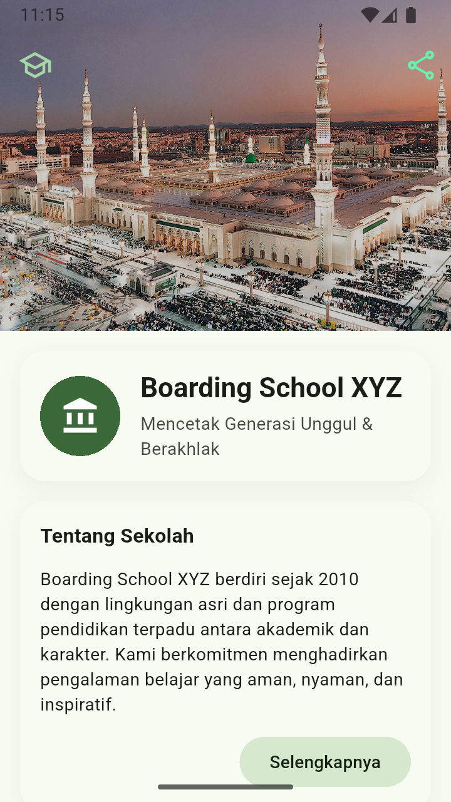

# 🏫 Boarding School UI

A modern and clean UI implementation for a Boarding School profile page built with Flutter.


## 📱 Screenshots


## ✨ Features

### 📌 Header Section
- Custom SliverAppBar with hero image
- School logo and tagline
- Sleek Material 3 design

### 🏢 Facilities
- Grid layout showcasing school amenities
- Interactive facility cards
- Icons with labels for:
  - Dormitory
  - Library
  - Sports Field
  - Laboratory
  - Mosque
  - Clinic

### 📚 Educational Programs
- National Curriculum
- Quran Memorization
- Sports & Arts Extracurricular
- Leadership Camp

### 🖼️ Gallery
- Image carousel with PageView
- Cached network images
- Smooth page indicators

### 📍 Location & Contact
- Interactive contact buttons
- Direct WhatsApp integration
- Google Maps integration
- Easy-to-copy contact details

## 🛠️ Technical Details

### Built With
- Flutter 3.x
- Material 3 Design
- Dart SDK 3.x

### Key Dependencies
```yaml
dependencies:
  flutter:
    sdk: flutter
  url_launcher: ^6.2.1
  cached_network_image: ^3.3.0
```

## 🚀 Getting Started

1. **Clone the repository**
```bash
git clone https://github.com/yourusername/uiBoardingSchool.git
```

2. **Install dependencies**
```bash
cd boarding-school-ui
flutter pub get
```

3. **Run the app**
```bash
flutter run
```

## 📸  Screenshots




## 📄 License

Distributed under the MIT License. See `LICENSE` for more information.


